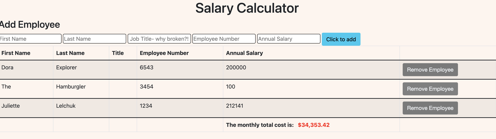
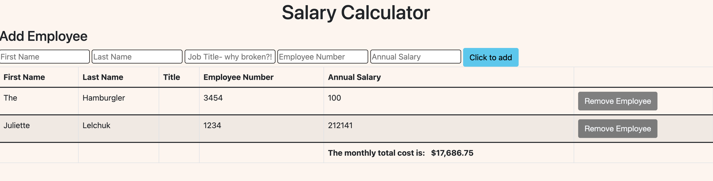

# jQuery Salary Calculator

## Description

_Duration: 8 Million Hours... ok more like 20_

The program needed to do these actions for the base mode:

* Use input fields to collect user data upon click of a submit button
* Store the user input so as to calculate monthly salary costs
* Append the total monthly costs to the DOM
* Make the background color of the monthly costs turn red if the dollar amount exceeds $20,000
* Have a delete button for each employee in the table

As a stretch goal, the program should:

* Remove a deleted employee's salary from the reported total

I started out by creating employee objects based on user input and pushing them to an array, based on intuition that it would serve me later for at least the stretch goal. I think this seems like a good practice for a real world scenario, but ultimately I didn't really end up using any of that for the base functionality or stretch.

I think the crux of the program is correctly routing the user's annual salary correctly, so it can both be calculated as a monthly figure and added to a running total of all annual salaries (which is then appended). I decided to create 2 global variables, one for the currentSalary, and one as the running total (accumulatedSalary).

I integrated functions of deleteEmployee with the action of subtracting their salary from the accumulatedSalary, and I created a separate function to check if the total monthly cost was greater than $20,000. I think my solution for targeting the specific employee's salary using $(this).parent().prev('.targetSalary').text() is probably more convoluted than it should be, but it works!

## Screen Shot

## Built With

jQuery, Bootstrap

